# Debugger presentation

The project was developed as part of the Advanced JavaScript Skillbox x UrFU IRIT-RTF course

## How to use?

Just include my JS file at the very end of your html document

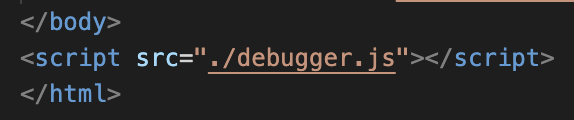

## Functions

1)The querySelector is used to find the element. You can write the name of a class or tag

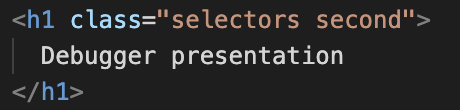
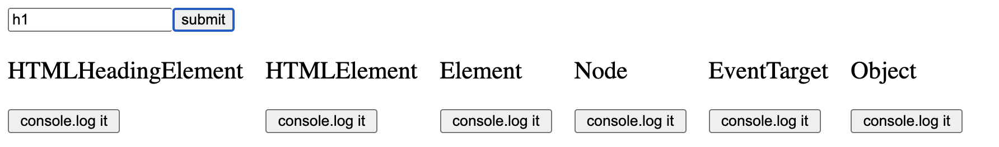
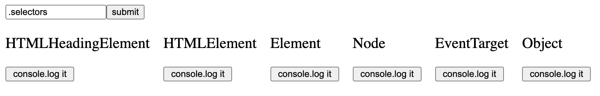

2)If you need to use 2 classes or more, then you can write it with a dot

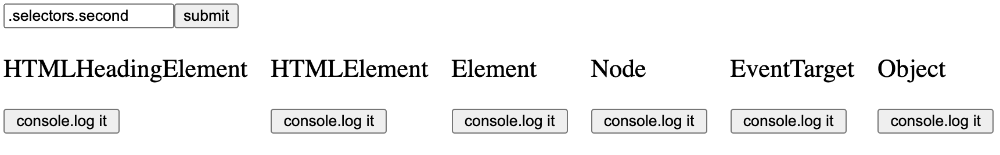

3)You can view any objects and variables in JavaScript, but you must use a declaration with var

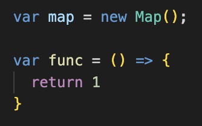
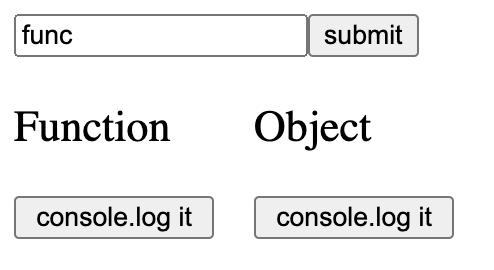
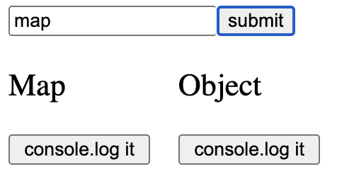
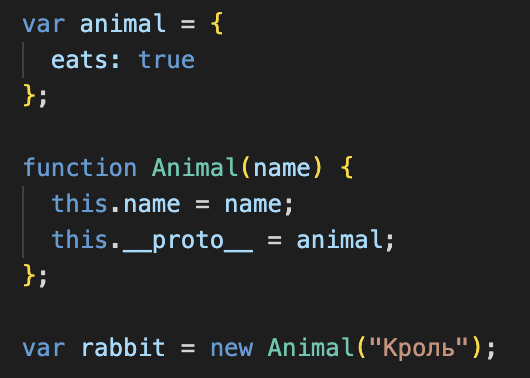
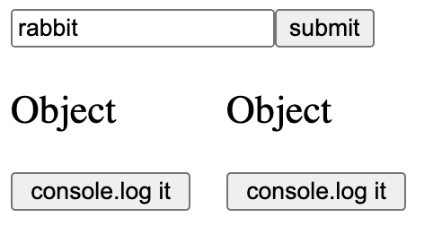

4)You can view the contents of each stage by this button

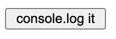
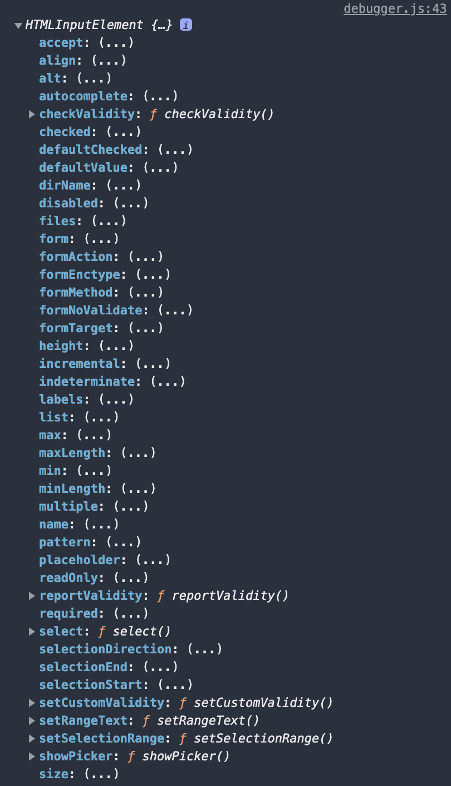

# Enjoy!